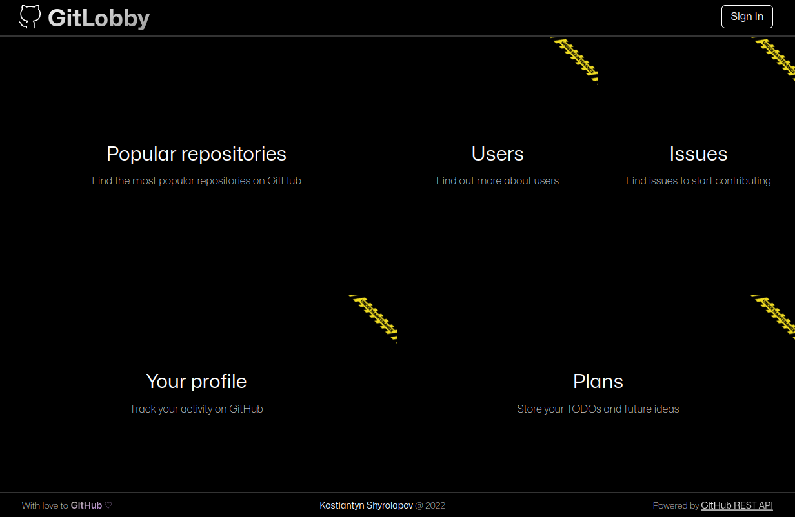
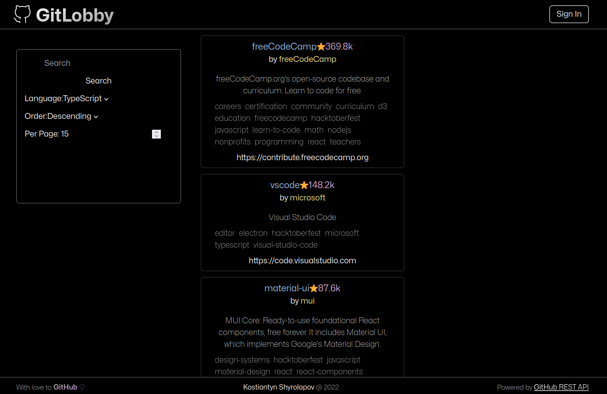

#### Learning to use REST API with pagination:

I've had experience of working with REST API at the time,
but not with ones that display a lot of data like GitHub does. When searching for something
on Github, they split results in pages. I wanted to see results displayed
in infinite scroll, so that's what I did here.

#### Learning about OAuth

OAuth is a wonderful piece of technology that lets user authenticate with services
they use everyday like Google, GitHub, etc. I thought it would be a perfect fit for user to
sign in with GitHub and track things associated with their GitHub account.

