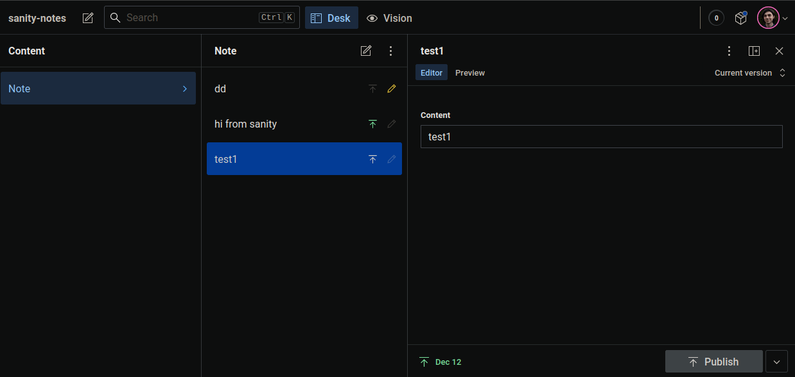

Sanity.io is a very nice headless CMS, which is relatively easy to configure for the framework
of your choice, but there is a feature that I personally would like to be able to quick-start
my project with: [**Sanity Studio**](https://www.sanity.io/studio) and its **Preview Mode**

I made this repo as a template to start with that feature, so that users can start to configure
their data models and publish their content right out of the gate.
