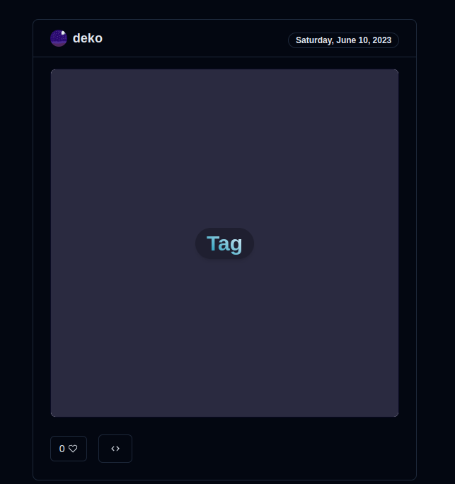

Sometimes I feel like sharing some fancy animated button I've made or even a little tag component that people can reuse.

There are 2 options I can think of:

- I could use services like Dribbble or similar that designers use. Problem is that they serve static assets, while I want users to be able to interact with components.
- On the other hand there are services like StackBlitz and CodeSandbox, which let users do exactly that - interact with components, but it's a lot harder to explore different designs and profiles and to get a quick response.

UI-crates uses Sandpack to run Node.js in a separate container for each post, and loads them in infinite feed. In terms of UI, post is just a rendered view of their JS code, with the button to toggle source code view. In that sense, it's a perfect balance between Instagram and CodeSandbox (at least for me).

Currently UI-crates supports only HTML/CSS with Tailwind, as I'm figuring out how to make React and other frameworks to load in a fair amount of time for UX.
Users can authenticate via Discord OAuth.

#### Tech:

- [T3 Stack](https://create.t3.gg/):

  - [Next.js](https://nextjs.org): Routing, SSR, StaticPaths, tRPC adapter
  - [NextAuth.js](https://next-auth.js.org): OAuth
  - [Prisma](https://prisma.io): ORM
  - [tRPC](https://trpc.io): backend-to-frontend typesafe API

- [Tailwind CSS](https://tailwindcss.com) with [shadcn/ui](https://github.com/shadcn/ui): tools for building UI components
- [Sandpack](https://sandpack.codesandbox.io/): in-browser JS runner
